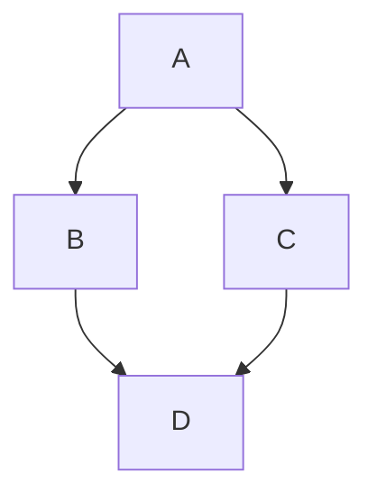
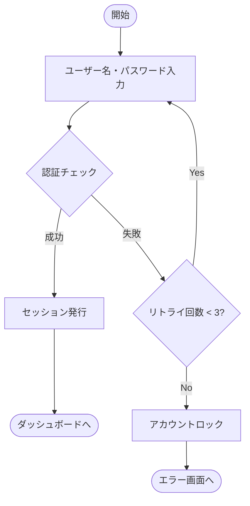
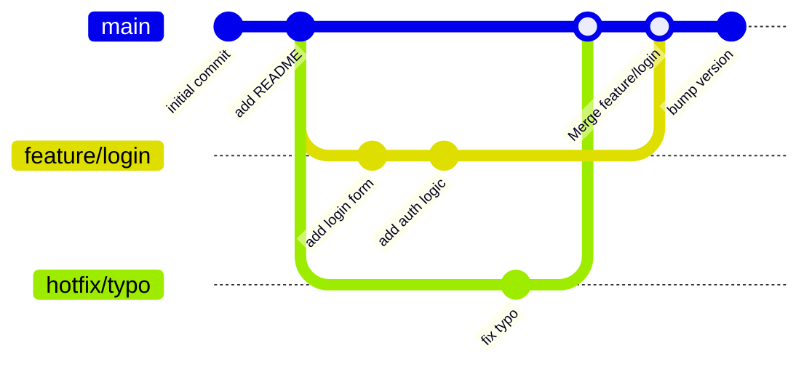

ダイアグラム等をマークダウン形式で描画できるようになるライブラリ、Mermaid.jsを導入した。
以下のライブラリを使用しMDやMDX内で使えるようにした。

https://github.com/sjwall/mdx-mermaid

### 例


### フローチャート


### Gitグラフ


VSCode内でも以下の```Markdown Preview Mermaid Support```ライブラリを導入することでプレビューできるようにした。

https://marketplace.visualstudio.com/items?itemName=bierner.markdown-mermaid